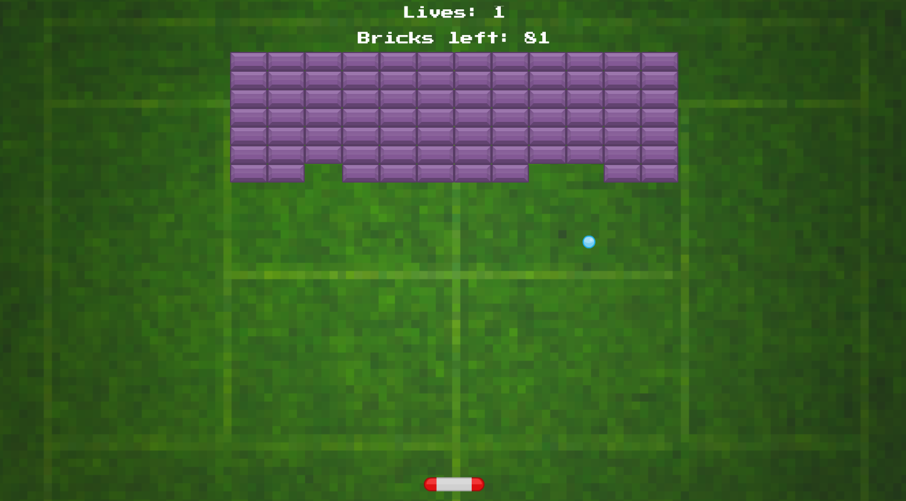

# Programmeren 4 - Toets Breakout - Opdracht B



In deze toets ga je het spel Breakout uitwerken. 

## Checklist voor uploaden
- Let op de deadline
- Uploaden op [Cumlaude](https://lms.hr.nl)
- Plaats de foto van het klassendiagram in de hoofdmap
- Vul het verantwoordingsdocument volledig in volgens de eisen van de beoordelingscriteria
- Maak een zip-bestand van de hoofdmap. Zet in de bestandsnaam van de zip je naam

## Spelregels

Breakout is een spelletje waar je met een balkje een balletje kan terugkaatsen. Iedere keer dat het balletje een blok raakt, verdwijnt het blok. In de scorebalk gaat er van het totaal aantal blokjes 1 blok af. 

Als de bal aan de onderkant het scherm verlaat, worden het balkje en de bal gereset naar hun beginpositie. Ook in de scorebalk gaat er 1 leven vanaf. 

Als er geen levens meer over zijn is het game over. Dit wordt getoond in de scorebalk. 

## Voorwaarden en tips

### Balkje
- start in het midden van het scherm en een klein stukje (5 %, mag je zelf bepalen) vanaf de onderkant. 
- kan links en rechts bewegen, maar niet het scherm uit. 
- heeft een snelheid van 7

### Ball
- start net boven het midden van het balkje. 
- heeft een snelheid -7 op de y-as
- heeft op de x-as willekeurig een snelheid van -3 of 3

### Blok
- Om een blok te kunnen plaatsen moet je weten waar het blok zal komen in het grid. Hiervoor kan je de volgende code gebruiken. Waarbij:
    - grid.columns = Totaal aantal kolommen
    - column = kolomnummer (begint bij 0)
    - row = rijnummer (begint bij 0)

```ts
let offsetX = (window.innerWidth - grid.columns * this.div.clientWidth) / 2
this.x = column * this.div.clientWidth + offsetX
this.y = row * this.div.clientHeight   + 100
```

